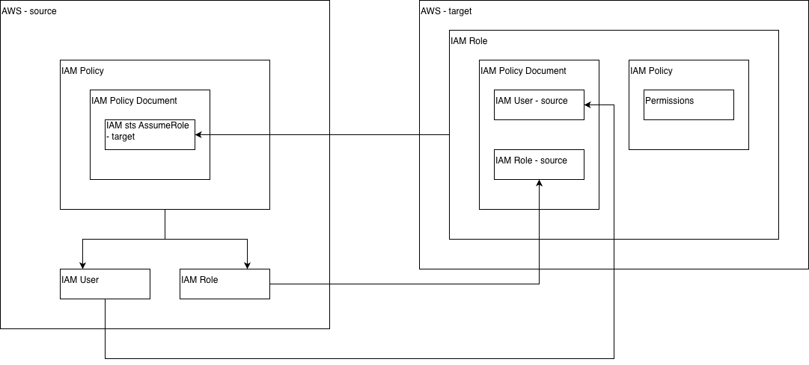

# OPH IAM Assume Role Terraform Module
This module provisions an IAM assume role from a target AWS account to a source AWS account.

## Installation
After you setup the configuration, see usage below, run `terraform init` to install module as a dependency.

## Usage
In your `main.tf` file, configure the source module and populate the required fields:

```terraform
provider "aws" {
  alias                    = "source_acc"
  profile                  = "source_acc"
  region                   = "us-east-1"
  shared_config_files      = ["~/.aws/config"]
  shared_credentials_files = ["~/.aws/credentials"]
}

provider "aws" {
  alias                    = "target_acc"
  profile                  = "target_acc"
  region                   = "us-east-1"
  shared_config_files      = ["~/.aws/config"]
  shared_credentials_files = ["~/.aws/credentials"]
}

module "assumptions" {
  source = "git::https://github.com/onlineproducthouse/oph.tf.assume_role.git?ref=main"

  providers = {
    aws.source = aws.source_acc
    aws.target = aws.target_acc
  }

  name                    = "assumptions"
  region                  = "us-east-1"
  source_role_identifiers = ["arn:aws:iam::123456789012:role/MyRole"]
  source_user_identifiers = ["arn:aws:iam::123456789012:user/MyUser"]

  policy_document_list = [
    {
      name = "IAMAssumeRole"
      policy_json_str = jsonencode({
        Version = "2012-10-17",
        Statement = [
          {
            Effect   = "Allow",
            Resource = "*",
            Action = "*",
          },
        ]
      })
    },
  ]
}
```

## How it works



- IAM Users and Roles must be created in the source account
- In the target account, an IAM Role is created with the relevant permissions and a policy document granting `sts:AssumeRole` to source account IAM Users and Roles
- In the source account, an IAM Policy with a policy document granting `sts:AssumeRole` for the target account IAM Role

## Contributing
Pull requests are welcome. For major changes, please open an issue first
to discuss what you would like to change.

Please make sure to update tests as appropriate.

## License
[MIT](https://choosealicense.com/licenses/mit/)
