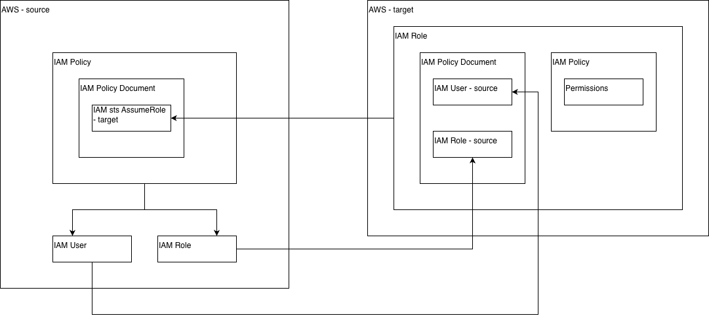

# OPH IAM Assume Role Terraform Module
This module provisions an IAM assume role from a target AWS account to a source AWS account.

## Installation
After you setup the configuration, see usage below, run `terraform init` to install module as a dependency.

## Usage
See [example/main.tf](./example/main.tf) for an example configuration.

## How it works

- IAM Users and Roles must be created in the source account
- In the target account, an IAM Role is created with the relevant permissions and a policy document granting `sts:AssumeRole` to source account IAM Users and Roles
- In the source account, an IAM Policy with a policy document granting `sts:AssumeRole` for the target account IAM Role

## Contributing
Pull requests are welcome. For major changes, please open an issue first
to discuss what you would like to change.

Please make sure to update tests as appropriate.

## License
[MIT](https://choosealicense.com/licenses/mit/)
